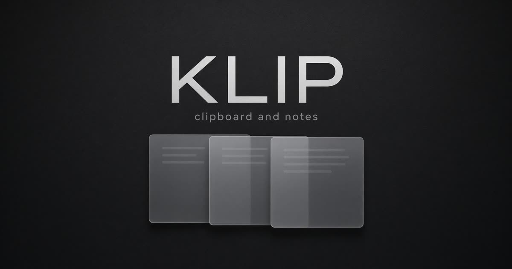

<div align="center">


# Клип

**Буфер, который ничего не забывает. Прозрачное окно Windows 10/11, заметки и история копирования.**

[](https://github.com/scarrymany/klip/releases/latest)
[](https://github.com/scarrymany/klip/actions/workflows/ci.yml)
[](https://github.com/scarrymany/klip/releases)
[](LICENSE)
[](#установка)
[](#сборка)
[](https://t.me/yeet17)
[](DONATE.md)

[Установка](#установка) · [Возможности](#возможности) · [Горячие клавиши](#горячие-клавиши) · [Сборка](#сборка) · [English](README.en.md)



</div>

---

## Что это

Windows забывает буфер после перезагрузки и после следующего копирования. Клип держит историю, заметки и код в одном прозрачном окне: нажали на карточку - текст снова в буфере.

Окно layered: скруглённые углы и полупрозрачная подложка, без DWM Mica/Acrylic. На Windows 10 то же самое, просто плотнее читается тёмный фон.

Записи лежат у вас: `%APPDATA%\Klip\klip.db`. Телеметрии нет. В сеть Клип ходит только чтобы проверить GitHub Releases и скачать обновление.

## Возможности

| | |
| --- | --- |
| **Автозахват** | Всё, что вы копируете текстом, сразу попадает в историю |
| **Одно нажатие** | Клик или Enter возвращает фрагмент в системный буфер |
| **Закрепление** | Важное остаётся сверху и не вытесняется лимитом в 500 записей |
| **Папки и типы** | Фрагменты, заметки, код, ссылки — плюс свои папки |
| **Поиск** | Строка сверху и живой фильтр по содержимому |
| **Трей** | Закрытие прячет окно, а не убивает программу |
| **Автозагрузка** | Опционально стартует вместе с Windows |
| **Автообновление** | Карточка справа сверху, кнопка «Обновить», проверка SHA256 |
| **Оформление** | Прозрачность, цвета, своё фото на фон с размытием |

## Установка

Скачайте последний релиз: [Releases](https://github.com/scarrymany/klip/releases/latest)

<table>
<tr>
<td width="33%" valign="top">

**EXE** - `Klip-Setup-1.1.1.exe`

Мастер Inno Setup на русском. Ярлыки и удаление из «Программ».

</td>
<td width="33%" valign="top">

**MSI** - `Klip-1.1.1-win-x64.msi`

Для тихой установки и корпоративных машин:

```powershell
msiexec /i Klip-1.1.1-win-x64.msi /qn
```

</td>
<td width="33%" valign="top">

**Portable** — `Klip-Portable-win-x64.zip`

Распаковали `Klip.exe` — работает. Права администратора не нужны.

</td>
</tr>
</table>

Проверка файла после загрузки:

```powershell
Get-FileHash .\Klip-Setup-1.1.1.exe -Algorithm SHA256
```

Сверьте с `SHA256SUMS.txt` из того же релиза.

> Нужен .NET runtime? Нет. Сборка self-contained: внутри уже есть .NET 9.

## Горячие клавиши

| Клавиши | Действие |
| --- | --- |
| `Ctrl + Shift + V` | Показать или спрятать окно |
| `Enter` | Скопировать выбранную запись |
| `Delete` | Удалить выбранную запись |

## Как устроено

```
копирование в Windows
        │
        ▼
  WM_CLIPBOARDUPDATE
        │
        ▼
   SQLite %APPDATA%\Klip
        │
        ▼
   окно / трей / поиск  ──►  SetText ──► снова в буфер
```

Повтор того же текста подряд не плодит дубликаты. Если такой текст уже был раньше, Клип поднимает старую карточку. Собственная вставка в буфер помечается и не пишется второй раз.

## Сборка

Нужны Windows 10/11 и [.NET 9 SDK](https://dotnet.microsoft.com/download/dotnet/9.0).

```powershell
git clone https://github.com/scarrymany/klip.git
cd klip
dotnet restore
dotnet build Klip.sln -c Release
dotnet publish src/Klip/Klip.csproj -c Release -r win-x64 --self-contained true -o dist/app
```

Релизные EXE и MSI собирает [GitHub Actions](.github/workflows/release.yml) по тегу `v*`.

```powershell
git tag v1.1.1
git push origin v1.1.1
```

## Вопросы

<details>
<summary>Почему окно не прозрачное на Windows 10?</summary>

Окно прозрачное за счёт layered WPF, не за счёт Mica. На Windows 10 это выглядит плотнее, на 11 сквозь подложку видно рабочий стол. Своё фото на фон размывается уже внутри программы.

</details>

<details>
<summary>Программа видит картинки из буфера?</summary>

Хранится текст. Картинки и файлы в историю не пишутся.

</details>

<details>
<summary>Нужен ли интернет?</summary>

Для самой истории нет. Проверка обновлений смотрит GitHub Releases при запуске и раз в четыре часа. Телеметрии нет.

</details>

<details>
<summary>Куда деваются данные при удалении?</summary>

Установщик стирает программу. База в `%APPDATA%\Klip` удаляется вместе с деинсталляцией EXE.

</details>

## Поддержать проект

Реквизиты — в [DONATE.md](DONATE.md).

## Лицензия

[MIT](LICENSE) © 2026 [scarrymany](https://github.com/scarrymany) · [@yeet17](https://t.me/yeet17)

<div align="center">

Если программа оказалась полезной, поставьте звезду

</div>
